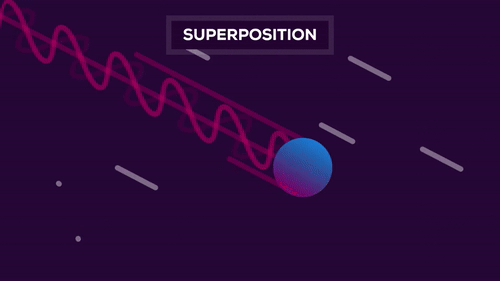

# Quantum Computers

We’ve been using computers since the early 19th century. We’re currently in the fourth generation of computers with microprocessors after vacuum tubes, transistors, and integrated circuits. They were all based on conventional computing which is based on the classical phenomenon of electrical circuits being in a single state at a given time, either on or off. **The fifth generation** of computers is currently under development which is quantum computing or quantum computers being the most popular.<sup>[1]</sup>

**Quantum mechanics** is a branch of physics that explores the physical world at a most fundamental level that deals with the mathematical description of the motion and interaction of subatomic particles, incorporating the concepts of quantization of energy, wave-particle duality, the uncertainty principle, and the correspondence principle.

**Quantum computer** is a type of computer that uses quantum mechanics so that it can perform certain kinds of computation more efficiently than a regular computer can.<sup>[2]</sup>

<table><tbody><tr><th>Conventional Computing</th><th>Quantum Computing</th></tr><tr><td>Conventional computing is based on the classical phenomenon of electrical circuits being in a single state at a given time, either on or off.</td><td>Quantum computing is based on the phenomenon of Quantum Mechanics, such as superposition and entanglement, the phenomenon where it is possible to be in more than one state at a time.</td></tr><tr><td>Information storage and manipulation is based on “bit”, which is based on voltage or charge; low is 0 and high is 1.</td><td>Information storage and manipulation is based on Quantum Bit or “qubit”, which is based on the spin of electron or polarization of a single photon.</td></tr><tr><td>The circuit behavior is governed by classical physics.</td><td>The circuit behavior is governed by quantum physics or quantum mechanics.</td></tr><tr><td>Conventional computing use binary codes i.e. bits 0 or 1 to represent information.</td><td>Quantum computing use Qubits i.e. 0, 1 and superposition state of both 0 and 1 to represent information.</td></tr><tr><td>CMOS transistors are the basic building blocks of conventional computers.</td><td>Superconducting Quantum Interference Device or SQUID or Quantum Transistors are the basic building blocks of quantum computers.</td></tr><tr><td>In conventional computers, data processing is done in Central Processing Unit or CPU, which consists of Arithmetic and Logic Unit (ALU), processor registers and a control unit.</td><td>In quantum computers, data processing is done in Quantum Processing Unit or QPU, which consists of a number of interconnected qubits.</td></tr></tbody></table>

## Why Quantum computers are the future?

### What's a transistor?

The transistor is the primary building block of all microchips, including your CPU (central processing unit). It is what creates the binary 0's and 1's (bits) your computer uses to communicate and deal with Boolean logic. When placed in different configurations, transistors form logic gates, which can combine into arrays called half adders that also combine into full adders.   
It is a miniature semiconductor that regulates or controls current or voltage flow in addition to amplifying and generating these electrical signals and acting as a **switch/gate** for them.    

| Transistor allowing the flow of electrons  | Transistor blocking the flow of electrons  |
|:---------------:|:---------------:|
| <p align = "center"></p> | <p align = "center"></p> |

### Moore's Law 

Moore's law is a term used to refer to the observation made by Gordon Moore in 1965 that the number of transistors in a dense integrated circuit (IC) doubles about every two years i.e. transistors will become small and small.   

Since the size of transistors is shrinking to the size of a few atoms, transistors cannot be used as switches because electrons may transfer themselves to the other side of a blocked passage by the process called quantum tunneling. 

### Quantum Tunneling

**Quantum tunneling** is a quantum mechanical phenomenon whereby a wave function can propagate through a potential barrier.  

| Classical Picture  | Quantum Picture  |
|:---------------:|:---------------:|
| <p align = "center"></p> | <p align = "center"></p> |

So, once the transistor reaches a threshold size, it can no longer be used to control the flow of electrons since electrons will pass straight through them via QT.  

This brings us to computers that don't use transistors, **THE QUANTUM COMPUTERS.**

[Watch this video about Quantum Computers by Kurzgesagt - In a Nutshell](https://youtu.be/JhHMJCUmq28)

----

## How do Quantum computers work?

**Classical computers** carry out logical operations using the definite position of a physical state. These are usually binary, meaning their operations are based on one of two positions. A single state - such as on or off, up or down, 1 or 0 - is called a bit. When you break a computer down, you will find a bunch of silicon chips with circuits of logic gates made up of transistors or switches which function using voltage. A high voltage represents the 'on' state of the switch equivalent to 1 and a low equivalent to 0. All forms of data text, music, audio, video, or software are ultimately encoded and stored by the computer as binary in the computer’s memory.<sup>[3]</sup> 

In quantum computing, operations instead use the quantum state of an object to produce what's known as a **qubit**.  
### Qubit

In quantum computing, a qubit or quantum bit is a basic unit of quantum information—the quantum version of the classic binary bit physically realized with a two-state device. A qubit is a two-state quantum-mechanical system, one of the simplest quantum systems displaying the peculiarity of quantum mechanics. These states are the undefined properties of an object before they've been detected, such as **spin of an electron, the polarization of a photon, trapped ions, semiconducting circuits, etc.**


<p align = "center">
<br>
Qubits can exist in both 0 and 1 state (called <b>superposition</b> state) before it is measured.    
</p>

**Superposition is the ability of a quantum system to be in multiple states at the same time until it is measured.** 

A single qubit can exist not only, in two discrete energy states, low and high (similar to 0 and 1) but it can also exist in a superposition state where in it exists in both states at once. When measured, however, the superposition fades and one of the two distinct states is returned based on the probabilities of each state.  

When using two qubits instead of a single qubit, 4 discrete energy states exist, (2 discrete states for each qubit) and a qubit can even exist in a superposition of these states.

Similarly using **n qubits**, 2<sup>n</sup> states are achieved which exist as combinations of 0s and 1s in parallel.  

So this gives a way to represent information. The next step is to process information, which requires manipulation of these qubits. This is brought about by the use of special quantum logic gates and quantum algorithms such as **Shor’s algorithm and Grover’s algorithm** which function using the principles of quantum mechanics of superposition, entanglement, and measurement. Without going into the complicated details of the quantum phenomena, the state of the qubits is manipulated by the application of precise electromagnetic waves, microwaves, and amplification functions as defined by the algorithms.<sup>[3]</sup>

[Watch this video about Quantum Superposition by Microsoft](https://youtu.be/glLPHgRle7o)  

But from the point of view of classical physics, this theory can be seen as counter-intuitive or even bizarre. Quantum objects appear to be at two places at the same time, electrical currents in a metallic wire can flow clockwise and counter-clockwise at the same time, or an object can sometimes behave as a wave and sometimes a particle.   

Even a Nobel laureate like Richard Feynman struggled with the implications of quantum mechanics, which led to his famous quote:   

```
I think I can safely say that nobody understands quantum mechanics
Richard Feynman
```

Rebecca Krauthamer, CEO of quantum computing consultancy Quantum Thought, compares quantum computing to a crossroads that allows a traveler to take both paths. “If you’re trying to solve a maze, you’d come to your first gate, and you can go either right or left,” she said. “We have to choose one, but a quantum computer doesn’t have to choose one. It can go right and left at the same time.”<sup>[4]</sup>   

<p align = "center"></p>


## References

1. https://www.geeksforgeeks.org/conventional-computing-vs-quantum-computing/
2. https://www.freecodecamp.org/news/what-is-a-quantum-computer-explained-with-a-simple-example-b8f602035365/
3. https://www.geeksforgeeks.org/rethinking-binary-with-quantum-computers/
4. https://builtin.com/hardware/quantum-computing